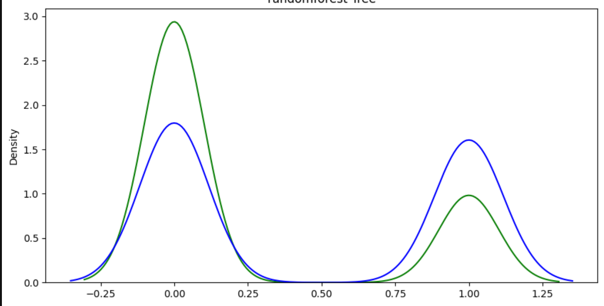
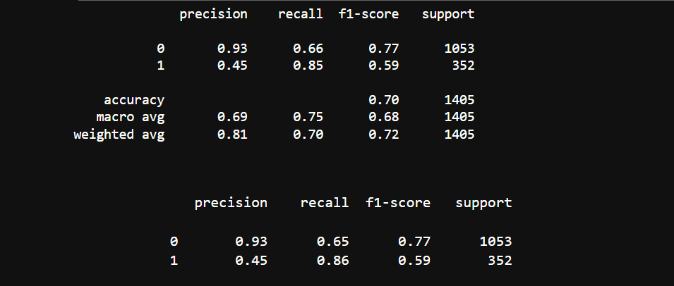

# 📊 Customer Churn Analysis & Insights for a Telecom Company

## 📌 Project Overview
This project focuses on analyzing customer data from a telecom company to build a predictive model that identifies customers at risk of churn. By understanding key factors driving churn, the business can proactively take actions to improve customer retention and satisfaction.

## 🎯 Objectives
- Analyze the relationship between customer demographics, services used, contract types, and churn behavior.
- Identify key features that influence churn.
- Develop and evaluate a machine learning model to predict churn.
- Provide actionable insights to help the company reduce churn.

## 🛠️ Tools & Technologies
- **Python**  
- **pandas**, **NumPy** for data manipulation  
- **matplotlib**, **seaborn** for visualization  
- **scikit-learn** for building and evaluating machine learning models  
- **Jupyter Notebook** for analysis and documentation

## 🖼️ Model Performance & Evaluation

### 📌 Model Performance

*Figure: ROC curve and confusion matrix showing model performance*

### 📝 Classification Report

*Figure: Detailed classification metrics including precision, recall, and F1-score*

## ✨ Key Insights
- Customers with shorter tenure and month-to-month contracts are more likely to churn.
- Higher monthly charges correlate with higher churn risk, while customers with higher total charges tend to be more loyal.
- Services such as multiple lines, lack of online backup or device protection increase churn risk.
- Demographic factors like being single or having no dependents are also associated with higher churn.

## ✅ Conclusion
By targeting customer segments identified as high-risk and offering tailored incentives or service improvements, the company can effectively reduce churn and enhance customer loyalty.

## 🙏 Acknowledgement
Thank you for taking the time to view this project!  
Your feedback and suggestions are highly appreciated to make this work even better.
